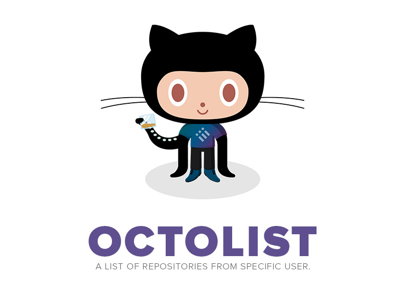

## Install [](http://badge.fury.io/js/octolist) [](http://badge.fury.io/gh/vitorbritto%2Foctolist)

[](https://nodei.co/npm/octolist/)

First of all, make sure you have [Node.js](http://nodejs.org/) installed.

```bash
$ [sudo] npm install octolist -g
```


## Usage

```bash
$ octolist <user> <page>
```

**Note:** You could also use with `ol` alias.

### Options

| Option | Usage    | Type   |
|--------|----------|--------|
| user   | Required | String |
| page   | Optional | Number |

**Help:** use `octolist --help` or `octolist -h` for more details.

### Example

```bash
$ octolist vitorbritto 1
```


## Contribute

Feel free to [contribute](https://github.com/vitorbritto/octolist/pulls) with this project or leave a [suggestion](https://github.com/vitorbritto/octolist/issues).


## License

[MIT License](http://vitorbritto.mit-license.org/) © Vitor Britto
